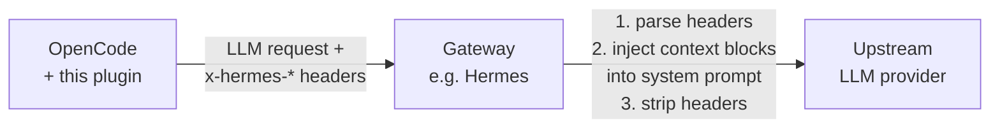

# opencode-hermes

Claude Code-style context reporting for [OpenCode](https://opencode.ai) — delivered as `x-hermes-*` HTTP request headers instead of prompt mutations.

On every LLM request the plugin computes the same dynamic context blocks that Claude Code injects into its system prompt (environment, scratchpad directory, git startup snapshot) and sends them as request headers. A gateway (e.g. Hermes) parses the headers, rebuilds the context blocks, and injects them into the request body — so context assembly lives in one place, on the server side.

[中文说明](README.zh-CN.md) · [Gateway contract (解析与注入规范)](docs/gateway-contract.md)

> **Note:** This plugin only *reports* facts. It does not modify your system prompt — injection is the gateway's job. Without a gateway that understands the headers, they pass through harmlessly.

## Quick Start

1. Add the plugin to your `opencode.json` (project or global `~/.config/opencode/opencode.json`):

```json
{
  "plugin": ["@ephemushroom/opencode-hermes"]
}
```

OpenCode installs `plugin` entries automatically with Bun on startup — no manual `npm install` step needed.

2. Restart OpenCode.
3. Send a message with a Claude model — the outgoing request now carries the `x-hermes-*` headers.

With options:

```json
{
  "plugin": [["@ephemushroom/opencode-hermes", {
    "environment": true,
    "scratchpad": true,
    "contextManagement": true,
    "gitStatus": true,
    "modelFilter": "claude",
    "scratchpadDirName": "claude",
    "gitTimeoutMs": 5000,
    "extraEnvironment": { "team": "platform" }
  }]]
}
```

## What You Get

| Header | Value | Description |
|---|---|---|
| `x-hermes-context-version` | `"1"` | Contract version, bumped on breaking changes |
| `x-hermes-environment` | ASCII-safe JSON | `agent`, `cwd`, `isGitRepo`, `platform`, `shell`, `osVersion`, `modelID`, `modelName` |
| `x-hermes-scratchpad` | ASCII-safe JSON | `{ "path" }` — directory already created on disk (mode `0o700`) |
| `x-hermes-context-management` | `"true"` | Flag only; the block is a static constant owned by the gateway |
| `x-hermes-git-status` | ASCII-safe JSON | `{ branch, mainBranch, user?, status, statusTruncated, recentCommits }` — **omitted entirely outside git repos** |

**ASCII-safe JSON:** every non-ASCII character (e.g. CJK file names in `git status`) is escaped as `\uXXXX`, because HTTP header values are transported as latin-1. `JSON.parse` / `System.Text.Json` restore them natively — no custom decoding.

### Model filtering

Headers are sent **only when the model ID contains `claude`** (case-insensitive). Requests to other models (kimi, gpt, …) pass through untouched — the gateway should not inject Claude Code-style context for them. Bedrock/OpenRouter-style IDs like `anthropic.claude-*` match as well. Change the substring with `modelFilter`, or set it to `""` to report for all models. Filtering is per-request: switching models mid-session only affects the requests that use them.

## How It Works



- The `chat.headers` hook fires on every LLM request; per-session caches keep git and scratchpad work to one shot per session.
- The gateway must **strip all `x-hermes-*` headers** before forwarding — they contain local paths and must never leak upstream raw.
- Parsing, injection templates, and C# examples: [docs/gateway-contract.md](docs/gateway-contract.md).

## Options

| Option | Default | Description |
|---|---|---|
| `environment` | `true` | Send `x-hermes-environment` |
| `scratchpad` | `true` | Send `x-hermes-scratchpad` and create the directory |
| `contextManagement` | `true` | Send `x-hermes-context-management` |
| `gitStatus` | `true` | Send `x-hermes-git-status` |
| `modelFilter` | `"claude"` | Only report when the model ID contains this substring; `""` disables filtering |
| `scratchpadDirName` | `"claude"` | Base directory name under the temp root |
| `gitTimeoutMs` | `5000` | Per-git-command timeout |
| `extraEnvironment` | — | Extra key/value pairs merged into the environment JSON |

## Environment Variables

| Variable | Effect |
|---|---|
| `HERMES_CONTEXT_DISABLE=1` | Disable the plugin entirely — no headers at all |
| `CLAUDE_CODE_TMPDIR` | Scratchpad temp root (same semantics as Claude Code) |

## Development

```bash
bun install
bun test            # bun's built-in runner, includes a live git-repo smoke test
bun run typecheck   # tsc --noEmit (strict)
bun run build       # bundle dist/index.js + emit declarations
bun run lint        # oxlint
```

Zero runtime dependencies — the plugin uses only Node/Bun built-ins, and the `@opencode-ai/plugin` import is type-only (erased at build time).

## License

MIT
